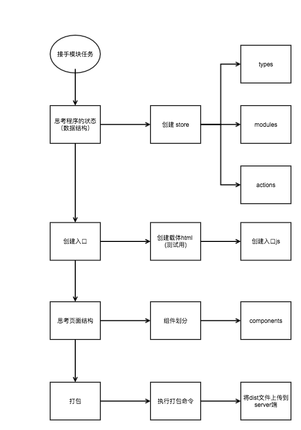

## 准备工作
1. node 环境
2. sublime 
3. sublime eslint 插件
4. [vue](https://cn.vuejs.org/index.html)
5. [vuex](https://vuex.vuejs.org/zh-cn/intro.html)
6. [Async/Await](https://cnodejs.org/topic/5640b80d3a6aa72c5e0030b6)

## 编译运行
1. npm install
2. npm run dev 
3. 打开另外一个终端 npm run serve (需跨域启动 chrome) 或者运行 npm start (不需要 chrome 跨域模式)
4. localhost:3000/app.html


## 目录说明
```
|-- dist                         --------编译输出目录
|-- src                          --------服务器端代码
    |--components                --------组件目录
    |--minxins                   --------全局 mixins
    |--store                     --------vuex store
        |--actions               --------
        |--modules               --------
        |--types
    |--utils                     --------工具类、函数
    |--app.js(*.js)              --------页面入口js
|-- build                        --------打包脚本
    |-- webpack.config.js        --------webpack 脚本
|-- .babelrc                     --------babel 配置
|-- .eslintrc                    --------eslint 配置
|-- .gitignore                   --------
|-- .stylelintrc                 --------stylelint 配置
|-- app.html(*.html)             --------入口 html
|-- doc                          --------文档配图
```

## 开发流程


## 注意事项
1. 使用了eslint 进行静态代码检查，并且使用了 husky 在提交前强制检查，检查不通过无法提交
2. 目前根目录下的 html，例如 app.html，只是作为测试载体，后续可能会优化脚本，可能不需要手动创建，目前每个页面都需要创建一个
3. src目录下的`*.js`（例如app.js）作为每个页面的入口 js
4. 对于异步操作，采取最新的 es7 规范 async/await（拥抱新变化），参看 `store/actions/app.js `
5. 所有的 url 请求链接需要定义在 utils/apiConfig 下，便于统一管理
6. 接口请求已经通过 request.js 封装
7. 本地测试需要用跨域的方式打开 chrome, mac 下使用命令
```
open -n /Applications/Google\ Chrome.app/ --args --disable-web-security  --user-data-dir=/Users/[yourname]/Documents/MyChromeDevUserData 

[yourname] 换成你的电脑名

```
8. 公共的样式提取到 common.css，组件内样式使用 `<style scoped></style>` 相互隔离（注意根组件独立 class 不要重名）
9. 主内容使用 .inner 样式类，960px 居中显示，flex 布局使用 .flex-container


